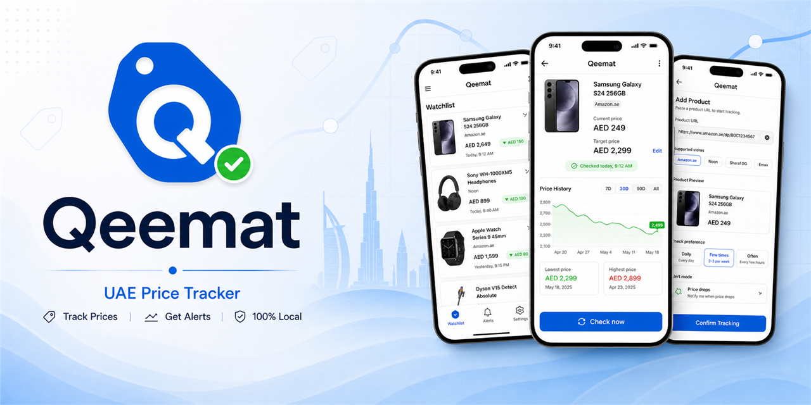

# Qeemat



Qeemat is an Android-first, local-first price tracker for a small set of supported shopping sites, with a UAE-first MVP plus selected Amazon regional domains. The current app is a React Native + TypeScript project with AsyncStorage-based local data, Android notifications, and best-effort Android background checks through WorkManager.

## Current MVP

Current implemented behavior:

- Add a supported product URL and confirm the parsed product before saving.
- Track products locally on-device with price history snapshots.
- Manual `Check now` from product detail.
- `Open link` from product detail to view the product in the system browser.
- Manual `Recheck all prices` from the watchlist.
- Check preferences per product: `daily`, `every_3_days`, `weekly`.
- Alert modes per product: `price_drop`, `any_change`, `target_price`.
- Best-effort Android background checks with a saved preferred time of day.
- Battery optimization status check and guidance in settings to improve background reliability.
- First-launch onboarding for notification permission and battery optimization.
- Local Android notifications for price drops, price changes, and target-price hits when permission is allowed.
- Snapshot history tags that show whether a check came from `Check now`, `Recheck all`, or `Background`.

Supported stores:

- Noon UAE
- Nike UAE
- Sun & Sand Sports UAE
- Level Shoes
- AYM Accessories
- Ounass UAE
- Amazon (selected regions)

## Documentation

- [Current state and AI handoff](docs/current-state.md)
- [MVP scope](docs/mvp-scope.md)
- [Local-only MVP plan](docs/local-only-mvp-plan.md)

Start with `docs/current-state.md` if you are resuming work in a new AI conversation or need the repo's current implemented behavior.

## Development

Install dependencies:

```bash
npm install
```

Start Metro:

```bash
npm run start
```

Run on Android:

```bash
npm run android:device
```

Useful checks:

```bash
npm run typecheck
npm run lint
npm test -- --runInBand
```

## Android Notes

Open the `android/` folder in Android Studio to sync, build, and run on a physical Android device or emulator.

If terminal builds fail:

- Make sure `JAVA_HOME` points to a valid JDK 17+ installation. Android Studio's bundled JBR is acceptable.
- Make sure `adb` is available from the Android SDK `platform-tools`.
- Android 13+ requires the runtime notification permission before local alerts can appear.

Background checks use Android WorkManager and are intentionally best-effort. Qeemat does not promise an exact run time.
