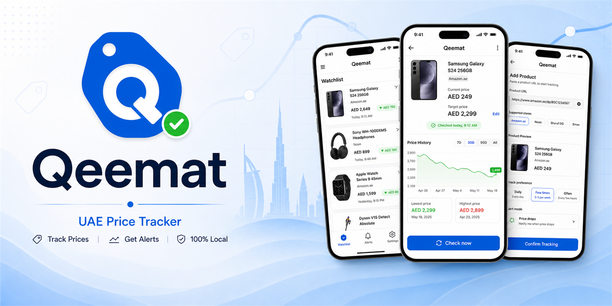

# Qeemat



Qeemat is an Android-first, local-first price tracker for UAE shopping sites and selected Amazon regional domains. It is built with React Native and TypeScript, stores data in AsyncStorage, and uses Android WorkManager and local notifications for best-effort background checks.

## Current MVP

- Add a supported product URL, confirm its parsed details, and track it locally with price snapshots.
- Clean tracking URLs before saving and fetching. Recognised Amazon links are normalized to a stable `/dp/<ASIN>` URL.
- Show watchlist cards, price history, activity events, price-change indicators, and out-of-stock status while preserving the last known price.
- Check a product or all products manually; choose daily, every-three-days, or weekly checking and price-drop, any-change, or target-price alerts.
- Open or copy a cleaned product link from product detail.
- Run best-effort Android background checks with local alerts, notification/battery-optimization guidance, and run diagnostics.
- Reflow cards, previews, details, and settings controls on compact phone widths and when large system text reduces available space.

Supported stores:

- Noon UAE
- Nike UAE
- Sun & Sand Sports UAE
- Level Shoes
- AYM Accessories
- Ounass UAE
- Amazon (selected regions)
- Adidas UAE

Brands For Less is an experimental integration and remains hidden from the supported-store UI because Cloudflare blocks reliable fetching. See [BFL integration](docs/bfl-integration.md).

## Documentation

- [Current state and AI/developer handoff](docs/current-state.md)
- [MVP scope](docs/mvp-scope.md)
- [Local-only MVP plan and decisions](docs/local-only-mvp-plan.md)
- [Completed mini-icon implementation (#16)](docs/issue-16-plan.md)
- [Brands For Less integration](docs/bfl-integration.md)

Start with `docs/current-state.md` for the current implementation and limitations.

## Development

```bash
npm install
npm run start
npm run android:device
```

Useful checks:

```bash
npm run typecheck
npm run lint
npm test -- --runInBand
```

## Android Notes

Open `android/` in Android Studio to sync, build, and run on a device or emulator. Terminal builds require JDK 17+ (Android Studio's bundled JBR is acceptable) and `adb` from Android SDK platform-tools.

Android 13+ requires runtime notification permission before local alerts can appear. Background timing is controlled by WorkManager and the device, so Qeemat does not promise an exact run time.
