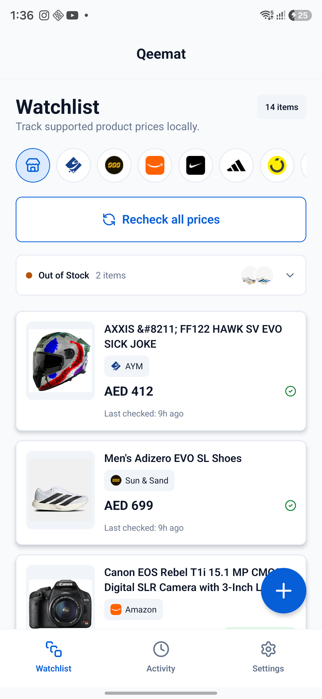
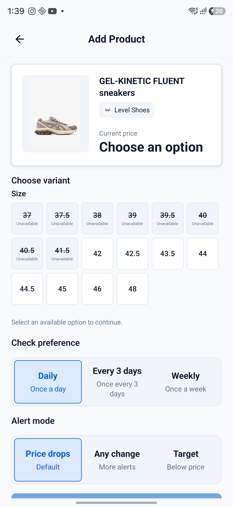
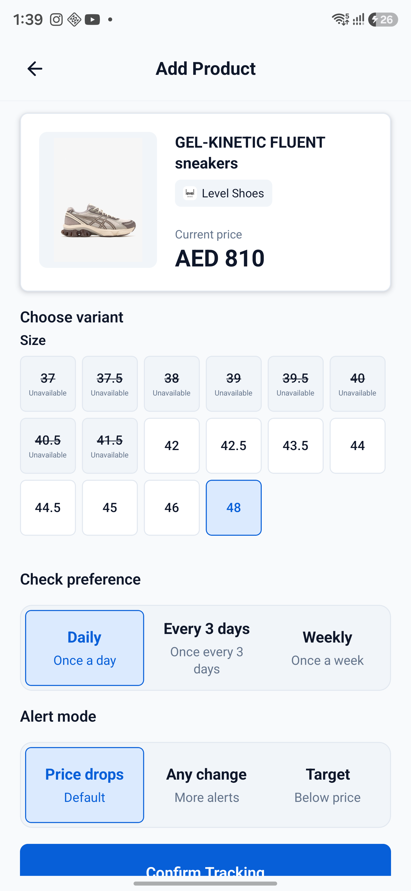

# Variant Tracking Visual Reference

These screenshots were captured from the Android release build on a Samsung Galaxy S24 Ultra using the Level Shoes GEL-KINETIC FLUENT product page.

## Watchlist store filter

The watchlist shows an all-stores control plus logo-only controls for stores represented in the saved products, keeping the filter compact while exposing each store through its accessibility label.

## Required selection

The product preview intentionally withholds a price until the user explicitly chooses an in-stock source option. Unavailable combinations are disabled, and the standard tracking controls remain visible below the selector.

## Selected in-stock option

After choosing a valid size, the preview updates to the selected variant's price and the user can continue with their check preference and alert mode.

