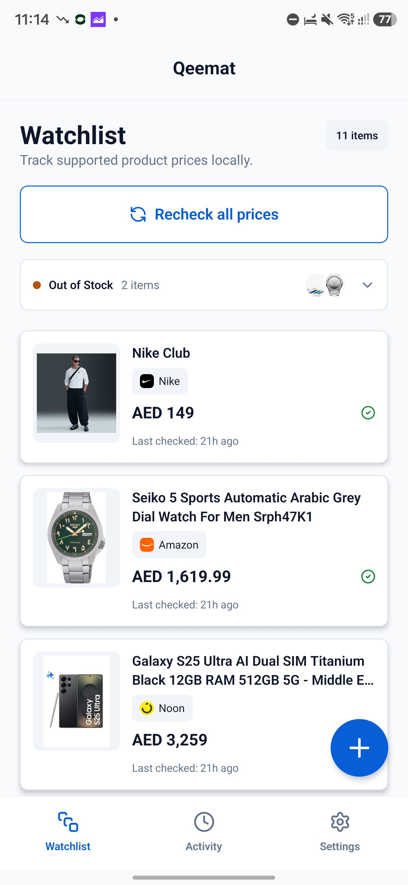
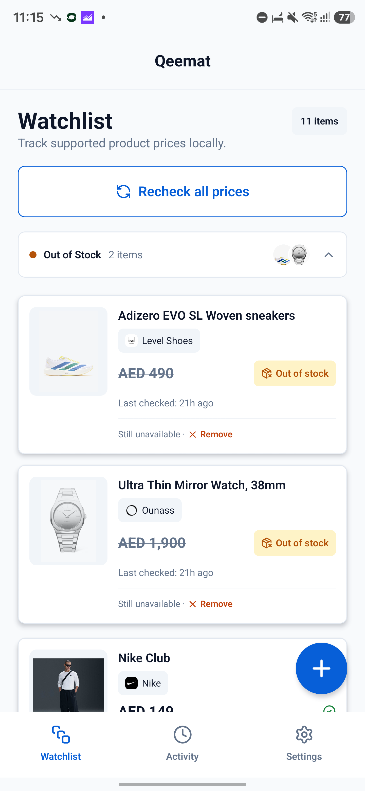
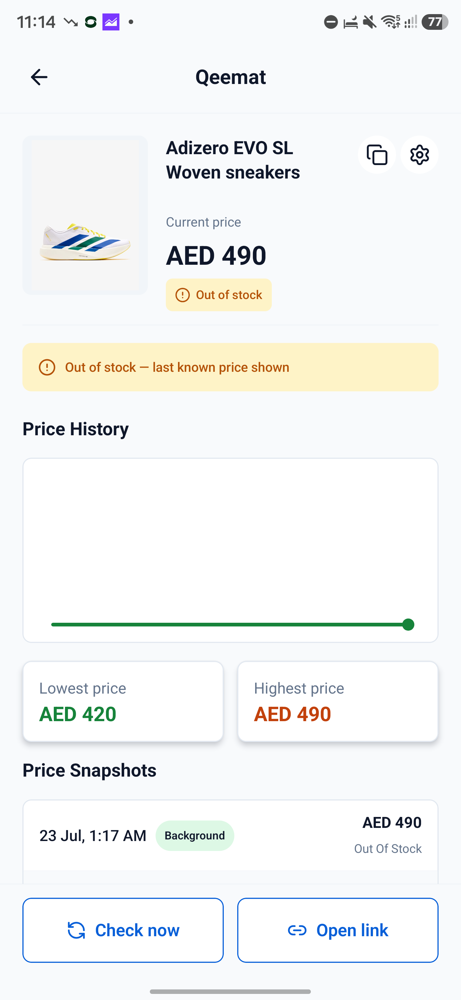
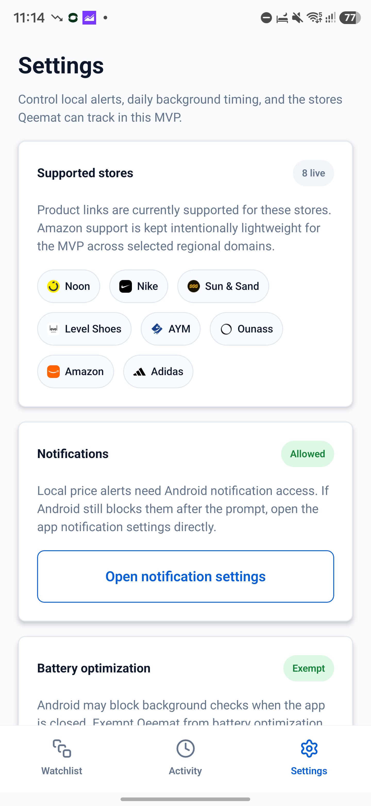
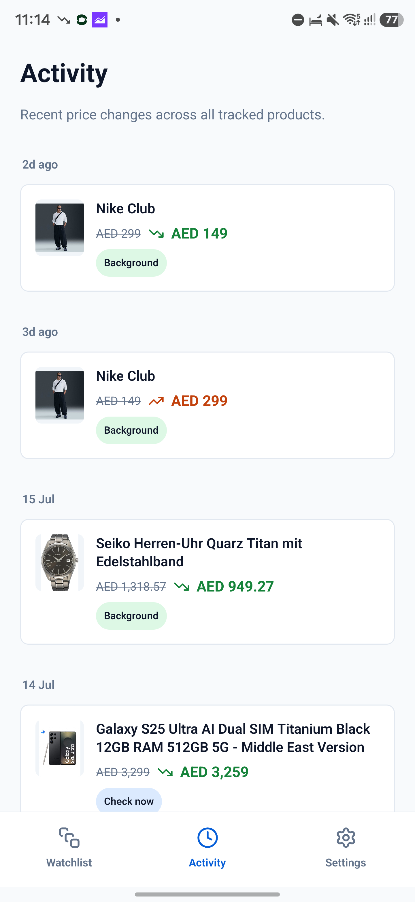

# v0.5-alpha — Safer tracking, smarter out-of-stock handling, and more stores

Qeemat `v0.5-alpha` is a major reliability update. Product tracking now handles out-of-stock pages properly, cleans up product links before saving them, spreads checks out to reduce rate limiting, and adapts much better to smaller Android phones and larger system text.

This release also expands the supported-store list, adds store icons throughout the app, and makes price movement much easier to understand from the watchlist and Activity feed.

---

## 📦 Out-of-stock tracking that behaves correctly

Qeemat can now recognize out-of-stock products across every supported store instead of treating a missing price as a generic failure.

- Out-of-stock products are moved into a collapsible section below the active watchlist.
- Cards are dimmed and clearly marked with an amber **Out of stock** badge.
- The last known price is preserved when a store no longer exposes a current price.
- Product details explain when the displayed value is the last known price.
- Availability changes appear in Activity and can trigger a notification.
- Amazon recommendation prices are ignored when the tracked product itself is unavailable.
- Unavailable products no longer overwrite their saved price with unrelated or incomplete page data.

## 🏪 More stores and clearer store identity

The supported-store list has grown and each store now has its own favicon-style icon across product cards, Activity, add-product previews, and Settings.

- Added **AYM Accessories**, with WooCommerce-aware parsing and a 72-hour minimum check interval.
- Added **Ounass UAE** using the store's embedded product data.
- Added **Adidas UAE**, with best-effort handling for its bot protection.
- Expanded Amazon parsing across selected regional domains, including more resilient image, currency, and buy-box handling.
- Added an experimental **Brands For Less** parser and WebView fallback. BFL remains hidden from the supported-store UI because Cloudflare still blocks reliable checks.
- Renamed the remaining **Level** label to **Level Shoes** and fixed its out-of-stock and price extraction behavior.

## 🔗 Cleaner, shareable product links

Product URLs are now cleaned before they are saved or fetched.

- Tracking parameters and URL fragments are removed from supported non-Amazon links.
- Recognized Amazon `/dp/` and `/gp/product/` links are normalized to a stable direct-ASIN URL.
- Product details now include a dedicated **Copy product link** action.
- The existing **Open link** action remains available when you want to jump to the retailer.

## 📈 Faster watchlist scanning

The watchlist and Activity feed now communicate price movement more clearly.

- Product cards show price direction at a glance.
- Redundant status badges were consolidated.
- The out-of-stock section includes product thumbnails and an item count.
- Snapshot history was refactored for clearer rendering and better performance.
- Activity continues to show where each update came from: **Check now**, **Recheck all**, or **Background**.

## 📱 Better on compact phones

Qeemat now reflows its main screens when usable width is limited by a smaller display or larger system font size.

- Watchlist cards, product previews, product details, action rows, settings controls, option groups, and time presets adapt to compact layouts.
- Shared text and relevant inputs cap extreme font scaling to keep controls usable.
- The floating add button position has been adjusted to avoid crowding the bottom navigation.

## 🛡️ Friendlier background checks

- Bulk checks are staggered instead of sending every request at once.
- Background checks wait 15 seconds between products; manual **Recheck all** runs use a shorter delay.
- AYM cannot be scheduled daily because the store enforces a longer effective interval.
- Error state and previous-price data are preserved more reliably.
- GitHub Actions now runs typecheck, lint, and tests for incoming changes.

## Small improvements 🧹

- Updated the app version to `0.5.0`.
- Added parser and regression coverage for availability, Amazon links, compact layouts, and check behavior.
- Removed unused template and screen code.
- Refreshed the README and implementation handoff documentation.
- Corrected the Adidas site icon so it packages properly in Android release builds.

## Alpha notes

- Qeemat remains Android-first and fully local; there is no account, cloud sync, or backend.
- Background scheduling is best effort and can still be delayed by Android or device-vendor battery restrictions.
- Amazon and Adidas checks remain best effort because their anti-bot behavior can change.
- Brands For Less is experimental and is not shown as a live supported store.
- The attached APK is for modern 64-bit ARM Android devices (`arm64-v8a`) only.

## Issues covered

[#2](https://github.com/AdamJeddy/Qeemat/issues/2), [#3](https://github.com/AdamJeddy/Qeemat/issues/3), [#4](https://github.com/AdamJeddy/Qeemat/issues/4), [#5](https://github.com/AdamJeddy/Qeemat/issues/5), [#6](https://github.com/AdamJeddy/Qeemat/issues/6), [#9](https://github.com/AdamJeddy/Qeemat/issues/9), [#11](https://github.com/AdamJeddy/Qeemat/issues/11), [#12](https://github.com/AdamJeddy/Qeemat/issues/12), [#13](https://github.com/AdamJeddy/Qeemat/issues/13), [#15](https://github.com/AdamJeddy/Qeemat/issues/15), [#16](https://github.com/AdamJeddy/Qeemat/issues/16), [#17](https://github.com/AdamJeddy/Qeemat/issues/17), [#18](https://github.com/AdamJeddy/Qeemat/issues/18), [#22](https://github.com/AdamJeddy/Qeemat/issues/22), [#23](https://github.com/AdamJeddy/Qeemat/issues/23), [#24](https://github.com/AdamJeddy/Qeemat/issues/24), [#25](https://github.com/AdamJeddy/Qeemat/issues/25), and [#26](https://github.com/AdamJeddy/Qeemat/issues/26).

**Full changelog:** [`v0.4-alpha...v0.5-alpha`](https://github.com/AdamJeddy/Qeemat/compare/v0.4-alpha...v0.5-alpha)
