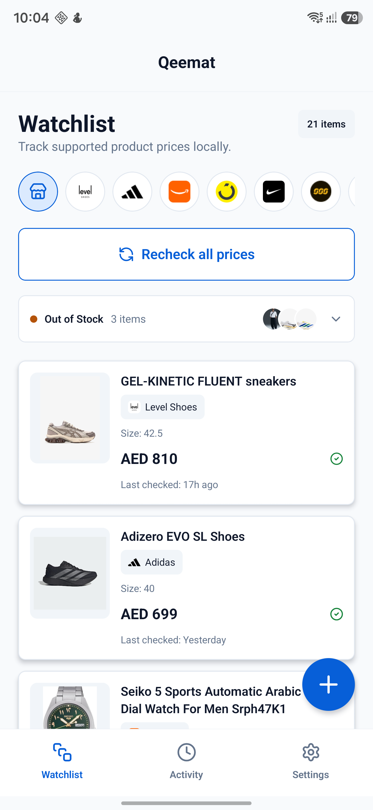
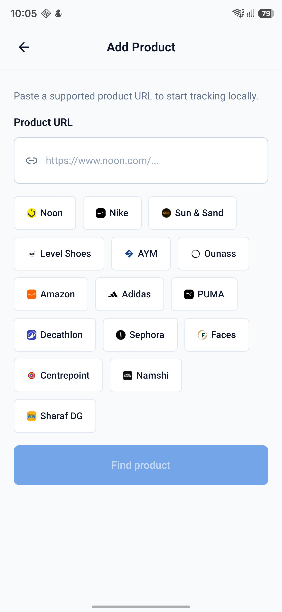
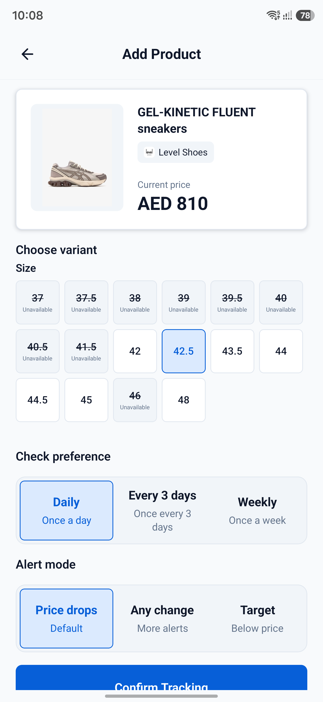
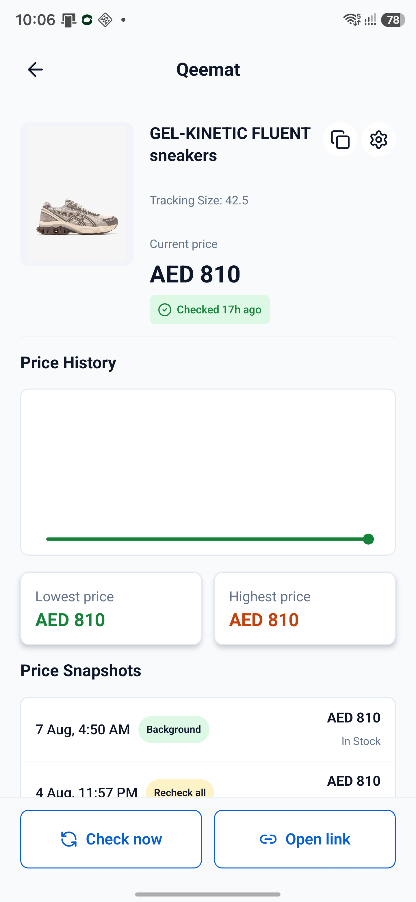
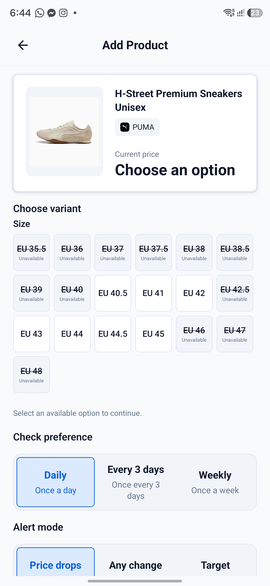
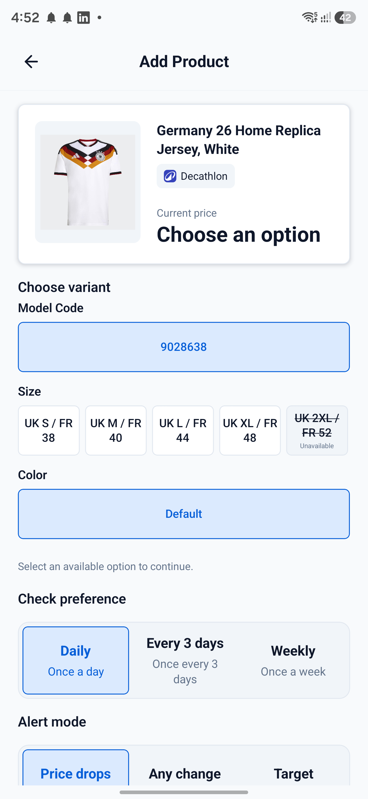
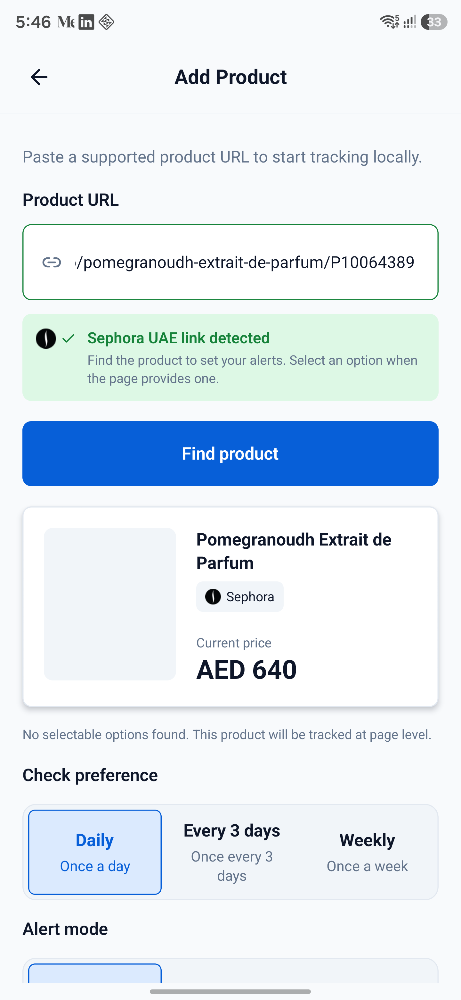
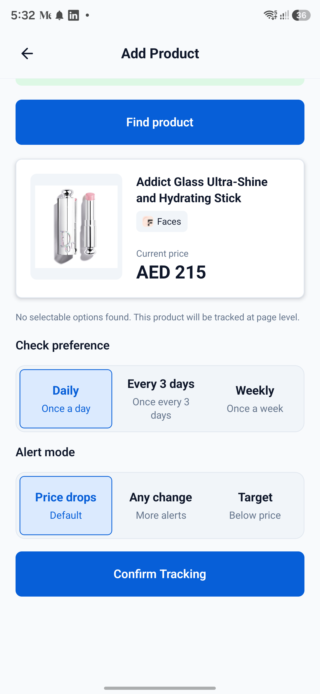

# Qeemat v0.5.5-alpha — New retailers, exact variants, and easier tracking

Qeemat `v0.5.5-alpha` expands the UAE retailer catalog, makes variant tracking safer and more precise, and removes friction from adding products on Android.

**Release date:** 2026-08-07

**Previous release:** [`v0.5-alpha`](https://github.com/AdamJeddy/Qeemat/releases/tag/v0.5-alpha)

**Full comparison:** [`v0.5-alpha...v0.5.5-alpha`](https://github.com/AdamJeddy/Qeemat/compare/v0.5-alpha...v0.5.5-alpha)

## Highlights

- Added Namshi UAE, Sharaf DG UAE, and Centrepoint UAE support.
- Added PUMA UAE, Decathlon UAE, Sephora UAE, and Faces UAE support to the supported-retailer experience.
- Added exact source-defined variant tracking across supported retailers that expose reliable option IDs, prices, and stock state.
- Added Android Share to Qeemat so a shared product URL opens the Add Product flow and starts parsing automatically.
- Added store filtering to the watchlist and refreshed retailer icons throughout the app.
- Improved Amazon price selection, out-of-stock handling, compact-phone layouts, and background-check reliability.

## Added

### More UAE retailers

- **Namshi UAE** — structured product parsing, source-defined size controls, and exact product/color routes.
- **Sharaf DG UAE** — electronics product metadata plus linked phone, color, keyboard, storage, RAM, and region configurations.
- **Centrepoint UAE** — storefront product parsing with source-defined color and size controls across group brands such as Splash.
- **PUMA UAE** — product parsing and reliable initial-page size variants.
- **Decathlon UAE** — Shopify `ProductJson` parsing for model, size, colour, price, and availability combinations.
- **Sephora UAE** — page-level product tracking with retries and a native WebView fallback for Akamai-protected pages.
- **Faces UAE** — structured product tracking with a native fallback for storefront session redirects.

### Exact variant tracking

When a retailer provides enough source data, Qeemat now lets the user choose the exact option before saving:

- Available options are derived from the initial product response instead of guessed or discovered through extra requests.
- Saved checks use the exact source option ID or URL.
- Incompatible option combinations can be switched without restarting the Add Product flow.
- Missing variants return `variant_not_found` instead of silently checking another configuration.
- Out-of-stock variants preserve the last known price and availability history.
- Sharaf DG configurations require explicit availability and a known price before they can be selected.

### Android Share to Qeemat

- Registered Qeemat as an Android share target.
- Handles both cold-start and warm-app share events.
- Extracts the product URL from shared browser text and opens the Add Product flow automatically.
- Keeps the final product preview, option choice, and tracking confirmation under explicit user control.

## Improved

### Watchlist and product flow

- Added logo-only retailer filters for stores currently represented in the watchlist.
- Added detected-store guidance and clearer Add Product preview states.
- Added consistent variant grids and clearer check-preference and alert controls.
- Product detail Copy and Open actions now use the saved variant URL when one exists.
- Compact layouts reflow watchlist cards, product previews, product details, action rows, settings, option groups, and time presets.

### Price and availability reliability

- Amazon now prefers the unambiguous base Buy Box price while ignoring Prime-only, alternate-seller, and unrelated recommendation prices.
- Confirmed out-of-stock pages can succeed without a current price while preserving the last known value.
- Background checks are staggered to reduce rate limiting.
- AYM tracking respects its 72-hour minimum interval.
- Adidas availability and release icon packaging were corrected.

### Retailer identity

- Added or refreshed compact retailer icons for PUMA, Decathlon, Sephora, Faces, Namshi, Sharaf DG, Centrepoint, and Adidas.
- Store identity is shown consistently in the Add Product flow, watchlist, Activity, product cards, and Settings.

## Fixed in the final release pass

- Sharaf DG redirects are resolved against the response’s final URL, preventing a removed configuration from being recorded as another option.
- Relative Sharaf DG configuration links are resolved before hostname validation.
- Centrepoint numeric buttons are only treated as sizes when they carry a size-control marker or source-specific identity.
- Sharaf DG options without explicit stock state or a known price are not exposed as selectable configurations.
- Selected Sharaf DG URLs are preserved for future checks and product-detail actions.

## Screenshots

### Watchlist and retailer filters

### Add Product and retailer icons

### Variant selection

### Product detail

Additional flow evidence from the merged retailer work:

## Closed issues included

- [#14 — Amazon price handling](https://github.com/AdamJeddy/Qeemat/issues/14)
- [#28 — Select the exact size or variant to track](https://github.com/AdamJeddy/Qeemat/issues/28)
- [#29 — Watchlist brand/store filter](https://github.com/AdamJeddy/Qeemat/issues/29)
- [#30 — Add Namshi to the brand list](https://github.com/AdamJeddy/Qeemat/issues/30)
- [#31 — Add Sharaf DG to the brand list](https://github.com/AdamJeddy/Qeemat/issues/31)
- [#32 — Add Decathlon to the tracking list](https://github.com/AdamJeddy/Qeemat/issues/32)
- [#33 — Add Sephora to the brand tracking list](https://github.com/AdamJeddy/Qeemat/issues/33)
- [#34 — Add Faces tracking](https://github.com/AdamJeddy/Qeemat/issues/34)
- [#35 — Add Centrepoint tracking](https://github.com/AdamJeddy/Qeemat/issues/35)
- [#36 — Share to Qeemat](https://github.com/AdamJeddy/Qeemat/issues/36)
- [#38 — Automatically find a shared product](https://github.com/AdamJeddy/Qeemat/issues/38)
- [#39 — Add PUMA UAE to the catalog](https://github.com/AdamJeddy/Qeemat/issues/39)
- [#44 — Update the Sharaf DG icon](https://github.com/AdamJeddy/Qeemat/issues/44)
- [#45 — Update the Namshi icon](https://github.com/AdamJeddy/Qeemat/issues/45)
- [#46 — Update the Centrepoint icon](https://github.com/AdamJeddy/Qeemat/issues/46)
- [#47 — Fix Sharaf DG variants](https://github.com/AdamJeddy/Qeemat/issues/47)

## Merged PRs

- [#40 — Ship variant-aware product tracking and Android UX updates](https://github.com/AdamJeddy/Qeemat/pull/40)
- [#41 — Update `shell-quote` dependency](https://github.com/AdamJeddy/Qeemat/pull/41)
- [#42 — Add shared product capture and UAE retailer tracking](https://github.com/AdamJeddy/Qeemat/pull/42)
- [#43 — Expand retailer coverage and fix product variant handling](https://github.com/AdamJeddy/Qeemat/pull/43)

## Validation

- `npm test -- --runInBand` — 9 suites passed; 103 tests passed; 1 fixture-dependent test skipped.
- `npm run typecheck` — passed.
- `npm run lint` — no errors; one existing inline-style warning remains in `App.tsx`.
- `git diff --check` — passed.
- Release screenshots captured on a physical Samsung Android device at 1440×3120.

## Alpha notes

- Qeemat remains Android-first, local-first, and backend-free.
- Background scheduling is best effort and may be delayed by Android or device-vendor battery restrictions.
- Amazon, Adidas, and Brands For Less remain sensitive to anti-bot or storefront changes; Brands For Less remains experimental and hidden from the supported-store UI.
- iOS native support is not maintained in this release.
